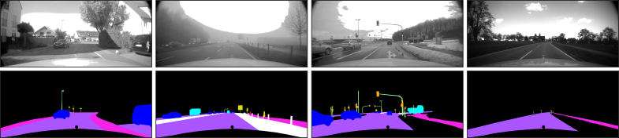
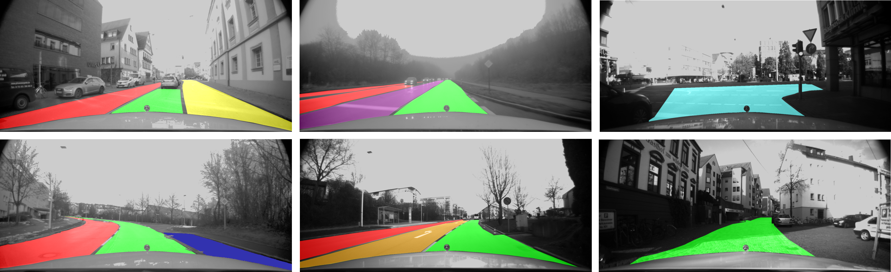
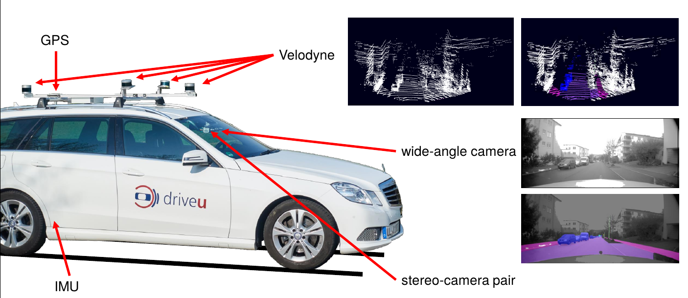

# The ADUULM-DATASET

## Dataset Overview

* Urban and rural scenarios in the surrounding of Ulm (Germany) and in diverse weather conditions (e.g. sunny, rainy, foggy, night, ...)
* Multiple Sensor-Setup: Cameras, Lidars, Stereo, GPS, IMU
* Appropriate for semantic segmentation, drivable area detection, ...

### Semantic Segmentation


<br>

* 12 classes (car, truck, bus, motorbike, pedestrian, bicyclist, traffic-sign, traffic-light, road, sidewalk, pole, unlabelled)
* 3482 finely annotated camera images
    - Training data: 1414 (good weather conditions only)
    - Validation data: 508 (good weather conditions only)
    - Test data: 1559 (different adverse weather conditions)
* Class definitions

| class_name     | class_id | short_cut | RGB_color |
| ------ | ------ | ------ | ------ |
| Unlabeled  |  0 |  u | (255, 255, 255)	|
| Sky | 1 |	s |	(0,	0, 0)	|
| Car | 2	|c	 | (0, 0, 255) |
| Truck  | 3 |	l |	(0,	255, 255) |
| Bus | 4 |	b|	(153, 153, 255)	|
| Motorcycle | 5 |	m |	(0, 0, 30)	|
| Pedestrian |  6 |	p |	(220, 20, 60)	|
| Bicyclist |  7 |	f |	(155, 40, 0)	|
| Traffic_sign |   8 |	v |	(220, 220, 0) |
| Traffic_light |  9 |	a |	(250, 170, 30) |
| Road   | 10|	r |	(170, 85, 55) |
| Sidewalk |   12 |	i |	(244, 35, 232) |
| Building |    13 |	g |	(70, 70, 70) |
| Pole  |  15 |	o |	(152, 251, 152)	|

### Drivable Area Detection


<br>

* 7 classes (ego lane, parallel lane, opposite lane, crossing area, parallel turn lane, opposite turn lane, parking lane)
* Simplified task with merged classes ego lane, parallel lane, opposite lane
* 2226 finely annotated camera images
    - Training data: 1472
    - Validation data: 561
    - Test data: 193
* Class definitions

| class_name     | class_id | RGB_color |
| ------ | ------ | ------ |
| Background  |  0 |  (0,0,0)	|
| EgoLane | 1 |	(0, 255, 0)	|
| ParallelLane | 2 | (255, 255, 0) |
| OppositeLane  | 3 |	(255, 0, 0) |
| CrossingArea | 4 |	(102, 255, 255)	|
| ParallelTurnLane | 5 |	(204, 204, 0)	|
| OppositeTurnLane |  6 |	(102, 0, 102)	|
| ParkingLane |  7 | (0, 0, 255)	|

## Getting Started

* The following compoents are required for this repository:

    - cv2
    - numpy
    - ros
    - yaml


* clone Repository
 
    ```
    $ git clone ssh://git@mrm-git.e-technik.uni-ulm.de:7678/pfeuffer/aduulm_dataset.git (To be updated!)
    $ cd aduulm_dataset
    ```


* Download the ADUULM-Dataset from the [ADUULM-Dataset webpage](https://www.uni-ulm.de/in/iui-drive-u/projekte/aduulm-dataset/). Please download the zip files of each folder and copy all data into one common dataset folder. After unzipping the files, your directory should look like this:

    ```
    .
    |-- ADUULM_DATASET
        |-- data
            |-- foggy
                |-- sample_01
                    |-- *.tiff
                    |-- *.pcd
                    |-- ...
                |-- sample_02
                    |-- ...
                |-- ...
            |-- night
                |-- sample_01
                    |-- ...
                |-- ...
            |-- ...
        |-- demo_sequences
            |-- *.bag
            |-- ...
        |-- image_splits
            |-- drivable_area_detection
                |-- *.txt
            |-- semantic_segmentation
                |-- split_training_good_weather_only
                    |-- *.txt
                |-- split_training_adverse_weather
                    |-- *.txt
        |-- metadata
            |-- *.yaml
        |-- ros_sequences
            |-- foggy
                |-- *.bag
            |-- night
                |-- *.bag
            |-- ...
    ```

* Create ground-truth from json-files:

    ```
    $ python scripts/prepare_TrainingData_SemanticSegmentation.py <path2ADUULM_DATASET> <image_split> <training_set> 
    $ python scripts/prepare_TrainingData_DrivableArea.py <path2ADUULM_DATASET> <task_variant> <training_set> 
    ```

    e.g.

    ```
    $ python scripts/prepare_TrainingData_SemanticSegmentation.py <path2ADUULM_DATASET> split_training_good_weather_only train
    $ python scripts/prepare_TrainingData_SemanticSegmentation.py <path2ADUULM_DATASET> split_training_good_weather_only val
    $ python scripts/prepare_TrainingData_SemanticSegmentation.py <path2ADUULM_DATASET> split_training_good_weather_only test
    $ python scripts/prepare_TrainingData_DrivableArea.py <path2ADUULM_DATASET> full train
    $ python scripts/prepare_TrainingData_DrivableArea.py <path2ADUULM_DATASET> full val 
    $ python scripts/prepare_TrainingData_DrivableArea.py <path2ADUULM_DATASET> full test 
    ```

* OPTIONAL: create dense-depth-image from lidar data according to paper [Robust Semantic Segmentation in Adverse Weather Conditions by means of Sensor Data Fusion](https://arxiv.org/pdf/1905.10117.pdf)
  
    ```
    $ python scripts/generate_DepthImage.py  <path2ADUULM_DATASET> <image_split> <training_set> 
    ```

    e.g.

    ```
    $ python scripts/generate_DepthImage.py  <path2ADUULM_DATASET> split_training_good_weather_only train
    $ python scripts/generate_DepthImage.py  <path2ADUULM_DATASET> split_training_good_weather_only val
    $ python scripts/generate_DepthImage.py  <path2ADUULM_DATASET> split_training_good_weather_only test
    ```

* OPTIONAL: extract previous camera images from provided ros-bags for recurrent neural networks (e.g. see [Robust Semantic Segmentation in Adverse Weather Conditions by means of Fast Video-Sequence Segmentation](https://arxiv.org/pdf/2007.00290.pdf))

    ```
    $ python scripts/extract_Images_from_ROSbag.py <path2ADUULM_DATASET> <image_split> <training_set> 
    ```

    e.g.

    ```
    $ python scripts/extract_Images_from_ROSbag.py  <path2ADUULM_DATASET> split_training_good_weather_only train
    $ python scripts/extract_Images_from_ROSbag.py  <path2ADUULM_DATASET> split_training_good_weather_only val
    $ python scripts/extract_Images_from_ROSbag.py  <path2ADUULM_DATASET> split_training_good_weather_only test
    ```


### Data Sample

    Each data-sample is stored in a separate folder and contains the following data:

* camera-images:

    - <folder_name>_camera_16bit.tiff:        wideangle camera image (16bit-image)
    - <folder_name>.json:               contains the image labels as polygon
    - <folder_name>_stereo_left.tiff:   left camera image of the stereo camera (16bit-image)
    - <folder_name>_stereo_disp.tiff:   disparity image of the stereo camera (16bit-image)
    <br>
* lidar-sensors

    <lidar_name> = [VeloFront, VeloRear, VeloLeft, VeloRight]

    - <folder_name>_<lidar_name>_syn.pcd:             time synchronized lidar points represented in the vehicle coordinate frame
    - <folder_name>_<lidar_name>_labeled.pcd:         fine-annotated lidar point cloud; each point contains the correspondint label-id stored in the color information
    <br>
* The raw lidar points, the corresponding gps and adma data can be extracted from the provided ros-sequences. Each ros-sequence also contains previous sensor data


### Sensor Setup


<br>

* wideangle camera of resolution 1920x1080
* stereo-camera pair of resolution 1920x1080
* rear camera of resolution 1392x1040
* four lidar sensors (Velodyne 16/32) mounted on the car‘s roof
* IMU
* GPS

### Label Policy


* camera annotation: 

    - annotations are given in json-file. Each object is described by a polgyon. The remaining points are classified as unlabeled!
    <br>
* lidar annotation:

    - the lidar point cloud is stored in pcd-format (of Point-cloud-Library)
    - the label-id of each point is stored in the color-information (<Point_XYZRGB>)

## Citations

For the case you use the ADUUlm-Dataset for your scientific work please do not forget to cite our BMVC2020 paper:

    
    @InProceedings{Pfeuffer_2020_TheADUULM-Dataset,
        Title = {The ADUULM-Dataset - A Semantic Segmentation Dataset for Sensor Fusion},
        Author = {Pfeuffer, Andreas and Sch{\"o}n, Markus and Ditzel, Carsten and Dietmayer, Klaus},
        Booktitle= {31th British Machine Vision Conference 2020, {BMVC} 2020, Manchester, UK, September 7-10, 2020},
        Year= {2020},
        Publisher= {{BMVA} Press}
    } 
    


